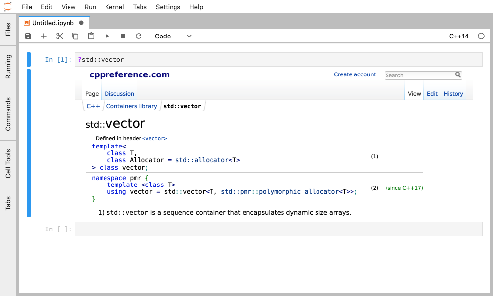
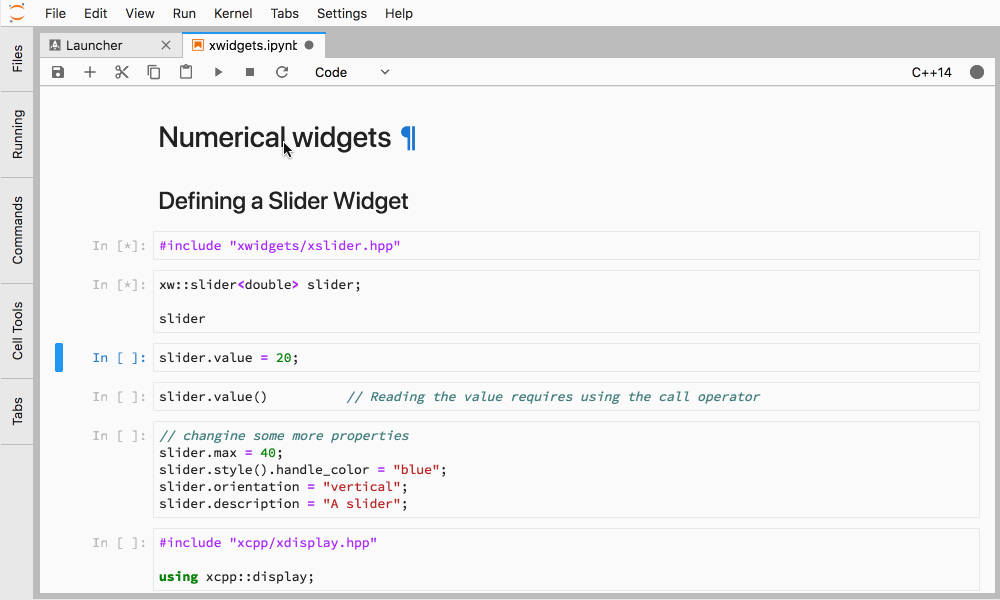

xeus-cling is a Jupyter kernel for C++ based on the C++ interpreter [cling](https://github.com/root-project/cling) and
the native implementation of the Jupyter protocol [xeus](https://github.com/jupyter-xeus/xeus).

## Documentation
To get started with using `xeus-cling`, check out the full documentation
http://xeus-cling.readthedocs.io/

## Usage
Launch the jupyter notebook with `jupyter notebook` and launch a new C++ notebook by selecting the **C++17** kernel in the *new* dropdown.

### Inline help and tab-completion
Quick help is shown on the pager with the special `?` magic.

Content for the quick help is available for the standard library, and can be made available for third-party packages.

### Rendering of rich outputs

### Jupyter interactive widgets

A C++ backend for the Jupyter interactive widgets is available in the [`xwidgets`](https://github.com/jupyter-xeus/xwidgets/) package.

## Dependencies

``xeus-cling`` depends on

 - [xeus-zmq](https://github.com/jupyter-xeus/xeus-zmq)
 - [xtl](https://github.com/xtensor-stack/xtl)
 - [cling](https://github.com/root-project/cling)
 - [pugixml](https://github.com/zeux/pugixml)
 - [cpp-argparse](https://github.com/p-ranav/argparse)
 - [nlohmann_json](https://github.com/nlohmann/json)

| `xeus-cling` |   `xeus-zmq`    |      `xtl`      |     `cling`   |   `pugixml`   | `cppzmq` | `cpp-argparse`| `nlohmann_json` | `dirent` (windows only) |
|--------------|-----------------|-----------------|---------------|---------------|----------|---------------|-----------------|-------------------------|
|  main        |  >=1.1.0,<2.0.0 |  >=0.7.0,<0.8.0 | >=0.9,<0.10   | ~1.8.1        | ~4.3.0   |     ~3.0      | ~3.11.2         | >=2.3.2,<3              |
|  0.15.3      |  >=1.1.0,<2.0.0 |  >=0.7.0,<0.8.0 | >=0.9,<0.10   | ~1.8.1        | ~4.3.0   |     ~2.9      | >=3.6.1,<4.0    | >=2.3.2,<3              |
|  0.15.2      |  >=1.1.0,<2.0.0 |  >=0.7.0,<0.8.0 | >=0.9,<0.10   | ~1.8.1        | ~4.3.0   |     ~2.9      | >=3.6.1,<4.0    | >=2.3.2,<3              |
|  0.15.1      |  >=1.0.0,<2.0.0 |  >=0.7.0,<0.8.0 | >=0.9,<0.10   | ~1.8.1        | ~4.3.0   |     ~2.9      | >=3.6.1,<4.0    | >=2.3.2,<3              |
|  0.15.0      |  >=1.0.0,<2.0.0 |  >=0.7.0,<0.8.0 | >=0.9,<0.10   | ~1.8.1        | ~4.3.0   |     ~2.9      | >=3.6.1,<4.0    | >=2.3.2,<3              |

## License
XEUS-CLING use a shared copyright model that enables all contributors to maintain the copyright on their contributions.
This software is licensed under the BSD-3-Clause license. See the [LICENSE](LICENSE) file for details.
